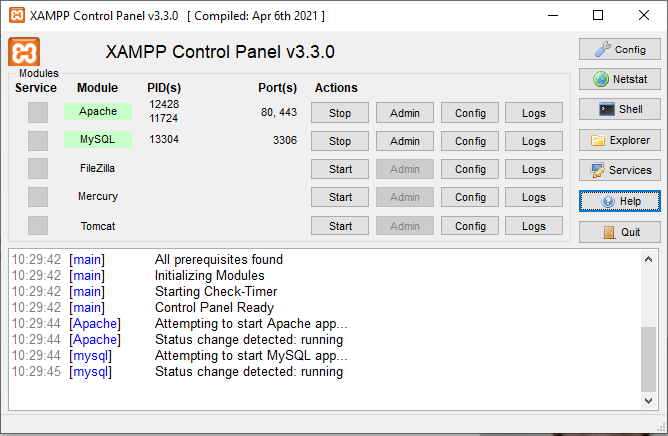
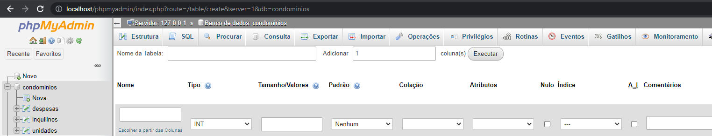
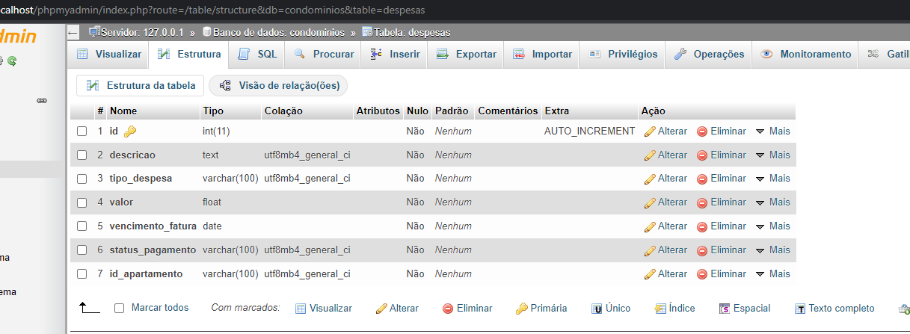
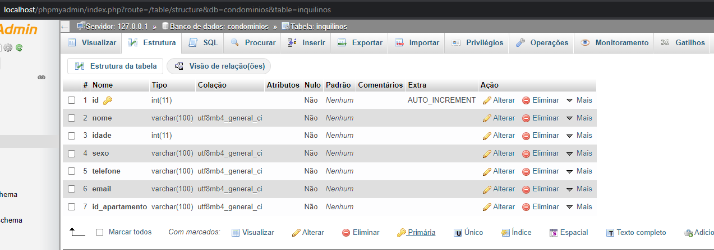
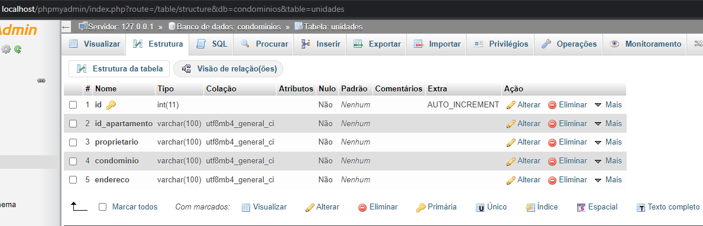

## Instalação
Você pode clonar este repositório OU baixar o .zip

Ao descompactar, é necessário rodar o **composer** pra instalar as dependências e gerar o *autoload*.

Vá até a pasta do projeto, pelo *prompt/terminal* e execute:
> composer install

Depois é só aguardar.

## Configuração
Todos os arquivos de **configuração** e aplicação estão dentro da pasta *src*.

As configurações de Banco de Dados e URL estão no arquivo *src/Config.php*

É importante configurar corretamente a constante *BASE_DIR*:
> const BASE_DIR = '/**PastaDoProjeto**/public';

## Uso
Você deve acessar a pasta *public* do projeto.

O ideal é criar um ***alias*** específico no servidor que direcione diretamente para a pasta *public*.

## Modelo de MODEL
```php
<?php
namespace src\models;
use \core\Model;

class Usuario extends Model {

}
```

## Instruções de como rodar a aplicação 

Para rodar o sistema em seu computador é necessário que você faça download e instale o XAMPP (XAMPP é uma distribuição do Apache fácil de instalar contendo PHP e MySQL), no link a seguir temos as opções para download: https://www.apachefriends.org/pt_br/download.html, o projeto foi implementado usando a linguagem de programação PHP 8 e padrão de projetos MVC, o banco de dados utilizado no projeto foi o MySQL, na figura a seguir vemos como utilizar o XAMPP no projeto, basicamente você deve ativar os módulos Apache e MySQL, além disso você deve clonar este repositório para dentro da pasta htdocs no XAMPP o caminho da pasta se você estiver em um sitema windows por exemplo será este: C:\xampp\htdocs, com o XAMPP ativado você acessara o projeto em http://localhost/apcoders/public/.



O banco de dados utilizado neste projeto foi implementado em MySQL, para você acessar o módulo MySQL do XAMPP, você deve acessar a URL http://localhost/phpmyadmin/, lembre-se que o módulo deve estar ativo como na imagem acima. Quando criar o banco de dados para interagir com o projeto deste repositório fique atento para usar os padrões de nomeação no banco que serão expostos a seguir, para não precisar renomear código fonte da implementação. Logo, você deve criar um banco com o nome e tabelas com suas colunas nomeadas de acordo com o exposto a seguir:

- condominios (banco de dados)
    - despesas (tabela)
        - id 
        - descricao
        - tipo_despesa
        - valor
        - vencimento_fatura
        - status_pagamento
        - id_apartamento
    - inquilinos (tabela)
        - id 
        - nome
        - idade
        - sexo
        - telefone
        - email
        - id_apartamento
    - unidades (tabela)
        - id 
        - id_apartamento
        - proprietario
        - condominio
        - endereco

Uma observação importante é que a coluna id em todas as tabelas é configurada com o índice como PRIMARY e o AUTO_INCREMENT é habilitado, estes aspectos são importantes para efetuar algumas operações com o Banco. A figura a seguir demonstra como o banco aparecera no módulo MySQL:



Estrutura da tabela despesas:



Estrutura da tabela inquilinos:



Estrutura da tabela unidades:

